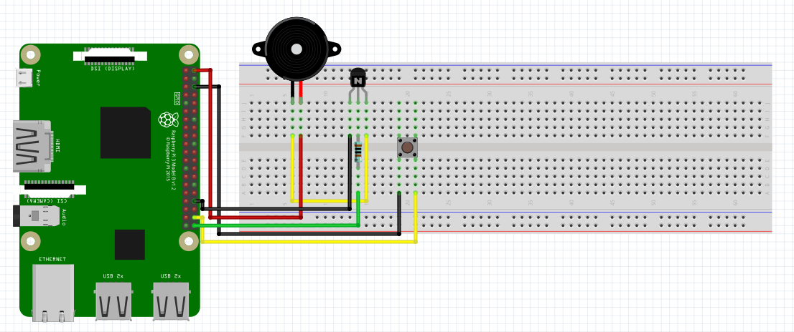

# Passive Buzzer:
Schematic - See below the schematic for instructions:
 

 
What You Will Need:
- Raspberry Pi
- Breadboard
- Jumper Wires
- Push Button
- 1KΩ Resistor
- Passive Buzzer
- NPN Transistor

Setting Up The Circuit:
1. Make the circuit: 
   GND(-) => Pin 1 On NPN Transistor 
   GPIO 21 On Raspberry Pi => 1KΩ Resistor => Pin 2 On NPN Transistor 
   Passive Buzzer GND(-) => Pin 3 On NPN Transistor 
   Passive Buzzer VCC(+) => 5V On Raspberry Pi 
   Push Button => 3.3V on Raspberry Pi 
   Push Button => GPIO 20 On Raspberry Pi
2. Open Thonny on your Raspberry Pi.
3. Create a file named main.py.
4. Copy the [main.py](main.py) file from my GitHub and paste it in the main.py file you have just created.
5. Click the run button in Thonny.
