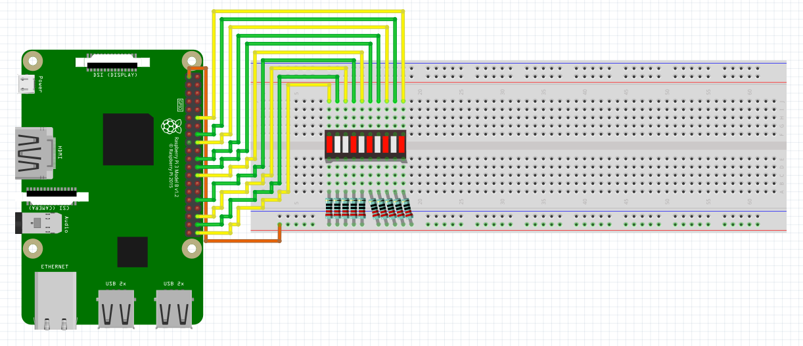

# LED Bar Graph:
Schematic - See below the schematic for instructions:
 

 
What You Will Need:
- Raspberry Pi
- Breadboard
- Jumper Wires
- LED Bar Graph
- 220Ω Resistors

Setting Up The Circuit:
1. Make the circuit: 
   LED Bar Graph Pin 1 - 10 => 3.3V On Raspberry Pi 
   LED Bar Graph Pin 11 => GPIO 21 On Raspberry Pi 
   LED Bar Graph Pin 12 => GPIO 20 On Raspberry Pi 
   LED Bar Graph Pin 13 => GPIO 16 On Raspberry Pi 
   LED Bar Graph Pin 14 => GPIO 12 On Raspberry Pi 
   LED Bar Graph Pin 15 => GPIO 7 On Raspberry Pi 
   LED Bar Graph Pin 16 => GPIO 8 On Raspberry Pi 
   LED Bar Graph Pin 17 => GPIO 25 On Raspberry Pi 
   LED Bar Graph Pin 18 => GPIO 24 On Raspberry Pi 
   LED Bar Graph Pin 19 => GPIO 23 On Raspberry Pi 
   LED Bar Graph Pin 20 => GPIO 18 On Raspberry Pi 
3. Open Thonny on your Raspberry Pi.
4. Create a file named main.py.
5. Copy the main.py file from my GitHub and paste it in the main.py file you have just created.
6. Click the run button in Thonny.
