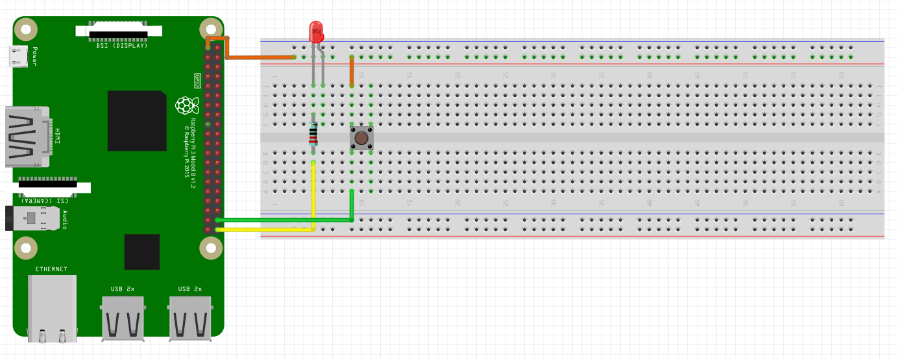

# LED Push Button:
Schematic - See below the schematic for instructions:
 

 
What You Will Need:
- Raspberry Pi
- Breadboard
- Jumper Wires
- LED
- 220Ω Resistor
- Push Button

Setting Up The Circuit:
1. Make the circuit:
   LED GND(-) => 220Ω Resistor => GPIO 21 On Raspberry Pi
   LED VCC(+) => 3.3V On Raspberry Pi
   Button => 3.3V On Raspberry Pi
   Button => GPIO 20 On Raspberry Pi
3. Open Thonny on your Raspberry Pi.
4. Create a file named main.py.
5. Copy the main.py file from my GitHub and paste it in the main.py file you have just created.
6. Click the run button in Thonny.
