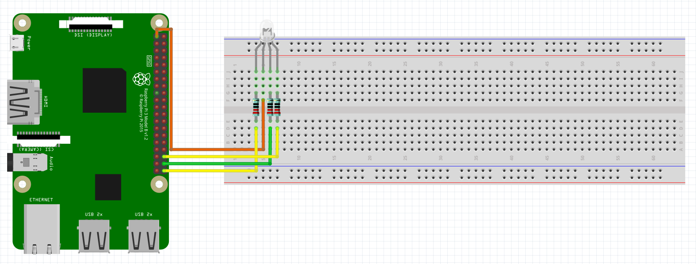

# RGB LED:
Schematic - See below the schematic for instructions:
 

 
What You Will Need:
- Raspberry Pi
- Breadboard
- Jumper Wires
- RGB LED
- 220Ω Resistor

Setting Up The Circuit:
1. Make the circuit: 
   LED Red Pin (Pin 1) => 220Ω Resistor => GPIO 21 On Raspberry Pi 
   LED VCC(+) (Pin 2) => 3.3V On Raspberry Pi 
   LED Green Pin (Pin 3) => 220Ω Resistor => GPIO 20 On Raspberry Pi 
   LED Blue Pin (Pin 4) => 220Ω Resistor => GPIO 16 On Raspberry Pi
2. Open Thonny on your Raspberry Pi.
3. Create a file named main.py.
4. Copy the [main.py](main.py) file from my GitHub and paste it in the main.py file you have just created.
5. Click the run button in Thonny.
